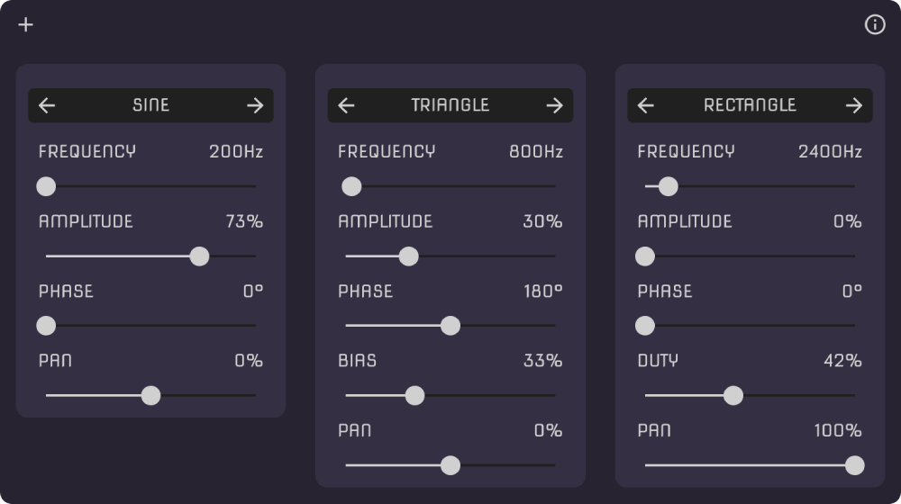

# Microwave

*MICROWAVE* (pronounced me-crow-wa-vè) is a simple signal generator written in Golang. It is capable of generating sine waves, as well as families of triangular and rectangular waves. This tool has been developed to assist with electronics workshops held at [Decentrala](https://dmz.rs/).




## Compile

Ensure you have the [Go compiler](https://go.dev/) and the [Fyne library dependencies](https://developer.fyne.io/started/#prerequisites) installed. In the root of the repository, run:

```bash
go mod download
go build
```

The application is should work on Linux, Windows, and OSX. It is only tested on Linux.

## Todo

- [ ] Check all waveforms on an oscilloscope
- [ ] Fix bugs with phase.
- [ ] Implement a log scale slider for frequency and pitch input (e.g., `A#2` or `C4`)
- [ ] Create a custom slider
- [ ] Add functionality for saving and loading setups
- [ ] Implement a waveform graph
- [ ] Reduce latency. Check why pipewire does't allow shorter buffers.

## License

The code is released under the [MIT license](LICENSE).

The font is distributed under the [SIL Open Font License](OFL).